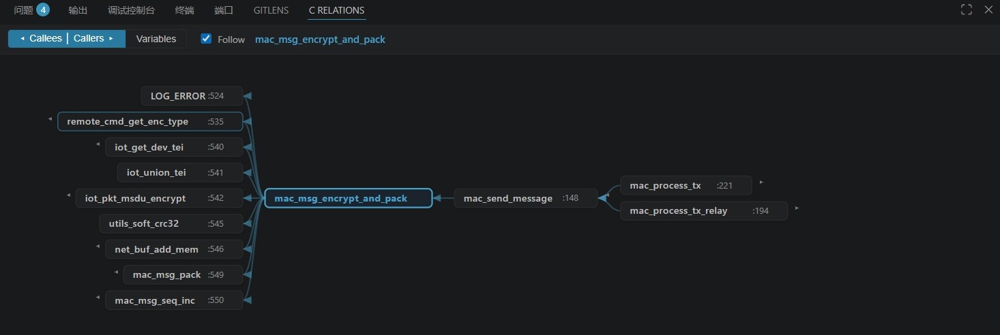

# C Call Graph

Explore C function call relationships and global/macro references in a
**Source Insight-style relation graph** — right inside VS Code.



Place the cursor on a C function and instantly see **who calls it** (right) and
**what it calls** (left) in a single bidirectional tree that follows your cursor.
No compiler, no `compile_commands.json`, no setup — parsing is built in via
[web-tree-sitter](https://github.com/tree-sitter/tree-sitter) and the index is
stored with [sql.js](https://github.com/sql-js/sql.js) (pure WebAssembly, so the
same package runs on any platform and any VS Code version).

## Features

- **Relation Graph** (bottom panel): bidirectional, cursor-following call tree.
  - **Right** = callers (who calls this function)
  - **Left** = callees (what this function calls)
  - Lazily expand to any depth (click ▸ / ◂)
  - Each node shows the call-site line; **double-click to jump there**
  - **Drag to pan, scroll to zoom**
- **Variables mode**: put the cursor on a global/static variable or `#define`
  macro → see which functions reference it.
- **Force-directed graph**: right-click → *Show Call Graph* for a global view.
- **Automatic & incremental indexing** of `.c`/`.h` files; only changed files are
  re-parsed on save.
- Resolves `static` functions, `extern "C"` blocks, function-pointer/callback
  registrations, and cross-file calls (by name — C has no overloading, so this is
  accurate in practice).

The index lives at `.vscode/cbm.db` inside your project.

## Usage

1. Open a C project. It indexes automatically (progress in the status bar).
2. Open the **C Relations** panel (bottom, next to Terminal/Output).
3. Move the cursor onto a function or variable — the graph updates.
4. Click ▸/◂ to expand, double-click a node to jump to the call-site.

Toggle **Follow** to freeze the current root. Run **C Call Graph: Reindex
Project** from the command palette to force a full rebuild.

## Requirements

None. Works out of the box on any C codebase.

## Known limitations

- C only.
- Cross-file resolution is name-based (function-pointer indirection through
  variables and macro-expanded calls are not tracked).
- Header files must be associated with the `c` language for the context menu.

## Development

```bash
npm install
npm run compile
node scripts/test-parser.js
npx tsc --outDir out && node scripts/test-store.js
npx vsce package
```

Press **F5** to launch an Extension Development Host.

## License

Apache-2.0 © Flianfa
